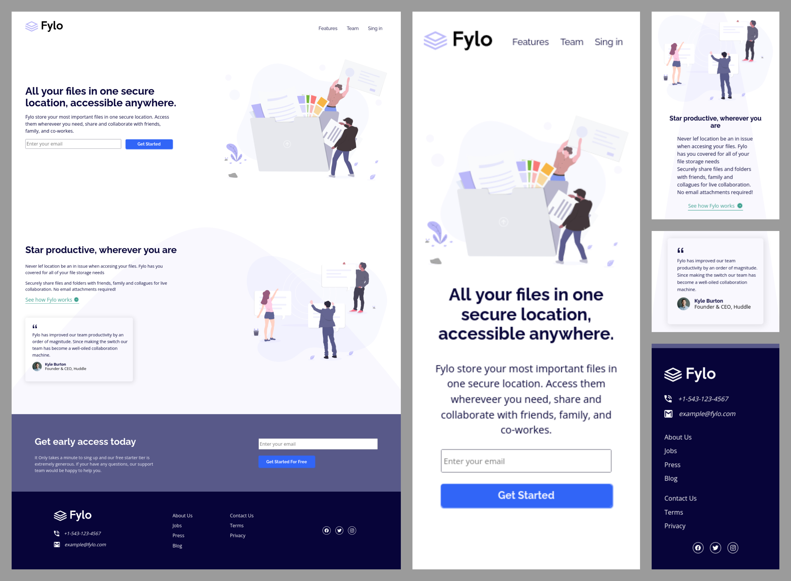

# Frontend Mentor - Solución a Fylo landing page with two column layout

Esta es una solución al [Desafío de Fylo landing page with two column layout en Frontend Mentor](https://www.frontendmentor.io/challenges/fylo-landing-page-with-two-column-layout-5ca5ef041e82137ec91a50f5).

## Tabla de contenido

- [Visión general](#visión-general)
  - [El reto](#el-reto)
  - [Capturas de pantalla](#capturas-de-pantalla)
  - [Enlaces](#enlaces)
- [Mi proceso](#mi-proceso)
  - [Construido con](#construción)
  - [Lo que aprendi](#lo-que-aprendi)
  - [Desarrollo continuo](#desarrollo-continuo)
  - [Recursos útiles](#recursos-útiles)
- [Autor](#autor)

## Visión general

### El reto

Los usuarios deben ser capaces de:

- Ver el diseño óptimo en función del tamaño de la pantalla de su dispositivo
- Ver los estados hover de los elementos interactivos

### Capturas de pantalla

- Escritorio y Movil



### Enlaces

- URL de la solución (Frontend Mentor): [Solución en Frontend Mentor](https://www.frontendmentor.io/solutions/accessibility-flexbox-responsivedesign-transition-hover-O0Ew3pw6M2)
- URL del sitio en vivo: [En vivo](https://boudgnosis.github.io/huddle-landing-page-/)

## Mi Proceso

### Construción

- HTML semántico
- Variables CSS
- Flexbox
- Accesibilidad web
- Media queries
- Responsive desing
- Efectos hover
- Transiciones
- Loanding (HTML5)

### Lo que aprendi

- Aprendí a usar la etiqueta **address**

- Descubrí que el atributo **href** de la etiqueta **a** sirve para colocar un número de teléfono y que esta abra la app que tenga disponible el computador o el smartphone.

```html
<a href="tel:+1-543-123-4567" class="tel">+1-543-123-4567</a>
```

### Recursos útiles

- [MDN Web Docs](https://developer.mozilla.org/es/) - Suelo usar este recurso porque explica muy bien todo además de que tiene una documentación muy amplia.
- [IONICONS](https://ionic.io/ionicons) - Es una página de iconos bastante sencilla de usar.

## Autor

- Codepen - [@boudgnosis](https://codepen.io/boudgnosis)
- Frontend Mentor - [@boudgnosis](https://www.frontendmentor.io/profile/boudgnosis)
- Twitter - [@juan_ariasd](https://twitter.com/juan_ariasd)
- Dev - [@juan_duque](https://dev.to/juan_duque)
- Linkedink - [juan pablo arias duque](https://www.linkedin.com/in/jpariasduque/)
